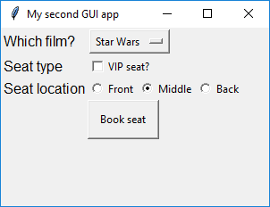
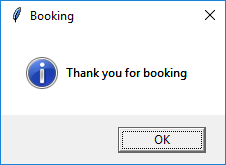

## Finishing the program

- Finally, add `PushButton` to the import list, then add a `PushButton` widget in `[1,3]` which calls a function called `do_booking` when it is pressed.

    ```python
    book_seats = PushButton(app, command=do_booking, text="Book seat", grid=[1,3], align="left")
    ```

    

- Add `info` (all lower case) to the import statement to allow us to use the info box function from guizero.

- **Outside** the GUI, write the function `do_booking()`. This will pop up an information box.

    ```python
    def do_booking():
        info("Booking", "Thank you for booking")
    ```

    

- You probably want to know how to retrieve the options the user chose. Add this code to your `do_booking()` function:

    ```python
    print( film_choice.value )
    print( vip_seat.value )
    print( row_choice.value )
    ```

    Notice that the `CheckBox` returns `0` if it is not checked and `1` if it is checked, and the `ButtonGroup` returns the hidden value (`F`, `M` or `B`) rather than the full text.

    


